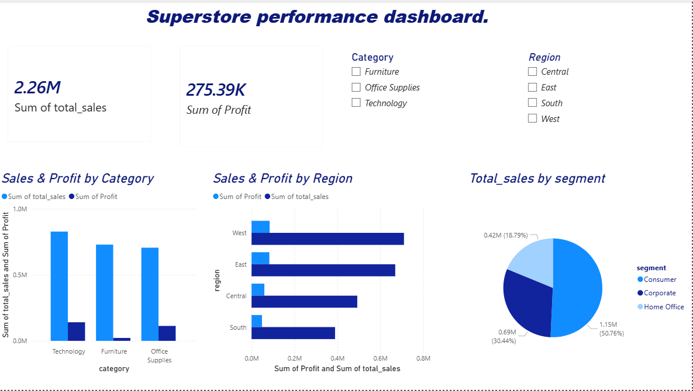

# Superstore Sales Analysis Project

##  Project Overview

This project focuses on analyzing Superstore retail sales data using SQL, PostgreSQL, and Power BI. The objective of the project was to explore sales performance across different product categories, customer segments, and regions while building an interactive business intelligence dashboard.

The project involved:

* Creating and managing a PostgreSQL database
* Cleaning and validating sales data using SQL
* Performing sales analysis queries
* Building an interactive Power BI dashboard
* Uploading and documenting the project on GitHub

---

#  Tools & Technologies Used

* **SQL** – Data querying and analysis
* **PostgreSQL** – Database management system
* **DBeaver** – Database management tool
* **Power BI** – Dashboard creation and visualization
* **Git & GitHub** – Version control and project hosting
* **Aiven PostgreSQL** – Cloud-hosted PostgreSQL database

---

# Database Structure

The project uses a PostgreSQL table named `orders` to store Superstore sales data.

## Orders Table Columns

| Column Name   | Description             |
| ------------- | ----------------------- |
| row_id        | Unique row identifier   |
| order_id      | Unique order identifier |
| order_date    | Date order was placed   |
| ship_date     | Date order was shipped  |
| ship_mode     | Shipping method used    |
| customer_id   | Unique customer ID      |
| customer_name | Customer full name      |
| segment       | Customer segment        |
| country       | Customer country        |
| city          | Customer city           |
| state         | Customer state          |
| postal_code   | Postal code             |
| region        | Sales region            |
| product_id    | Unique product ID       |
| category      | Product category        |
| sub_category  | Product sub-category    |
| product_name  | Product name            |
| sales         | Sales amount            |

---

#  Data Cleaning Process

The dataset was cleaned using SQL queries to ensure data quality and consistency.

### Cleaning Conditions Applied

* Removed records with missing order dates
* Removed records with missing ship dates
* Ensured ship dates were greater than or equal to order dates
* Removed records with invalid sales values
* Ensured customer and product IDs were not null

### Example Cleaning Query

```sql
SELECT * FROM public.orders
WHERE
    order_date IS NOT NULL
    AND ship_date IS NOT NULL
    AND ship_date >= order_date
    AND sales > 0
    AND customer_id IS NOT NULL
    AND product_id IS NOT NULL;
```

---

#  SQL Analysis Performed

The project included several analytical SQL queries to generate business insights.

## Monthly Sales Analysis

Analyzed sales trends by:

* Month
* Region
* Product category

### SQL Concepts Used

* DATE_TRUNC
* GROUP BY
* Aggregate functions
* ORDER BY

---

## Product Category Performance

Analyzed:

* Total orders by category
* Total sales by category
* Product ranking using window functions

### SQL Concepts Used

* RANK() window function
* SUM()
* COUNT(DISTINCT)

---

## Customer Sales Analysis

Identified:

* Top customers by sales
* Customer purchasing behavior
* Sales contribution by customer segment

---

#  Power BI Dashboard

An interactive Power BI dashboard was created using the PostgreSQL database connection.

## Dashboard Features

* Total Sales KPI
* Profit KPI
* Sales & Profit by Category
* Sales & Profit by Region
* Total Sales by Customer Segment
* Interactive Filters for:

  * Category
  * Region

## Key Dashboard Insights

* Technology products generated the highest sales
* The West region recorded the strongest sales performance
* Consumer segment contributed the largest share of total sales
* Furniture and Office Supplies showed lower profit contribution compared to Technology

---

#  Dashboard Preview



---

# Skills Demonstrated

This project demonstrates practical skills in:

* SQL Query Writing
* PostgreSQL Database Management
* Data Cleaning & Validation
* Business Intelligence Reporting
* Power BI Dashboard Design
* Data Visualization
* Git & GitHub Version Control
* Cloud Database Connectivity

---

# Repository Contents

This repository includes:

* SQL scripts
* PostgreSQL table creation queries
* Data cleaning queries
* Analytical SQL queries
* Power BI dashboard file (.pbix)
* Dashboard screenshots
* Project documentation

---

#  Conclusion

This project provided hands-on experience in working with retail sales data using SQL and Power BI. Through data cleaning, SQL analysis, and dashboard development, the project demonstrates how raw business data can be transformed into actionable insights.

The project also highlights the importance of SQL in data analytics workflows and shows how Power BI can be used to create interactive dashboards for business reporting and decision-making.


